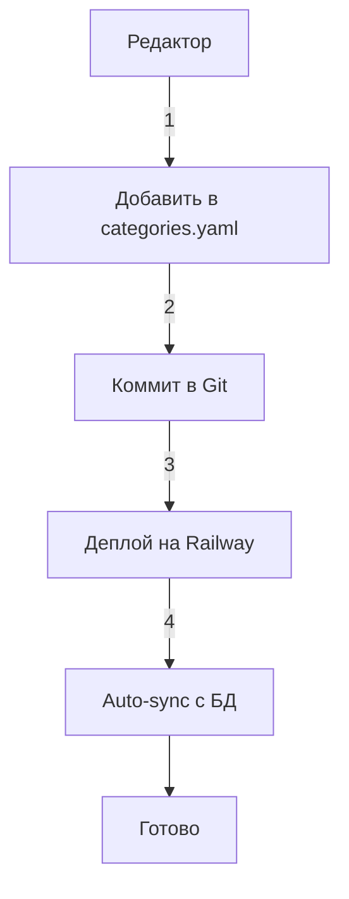
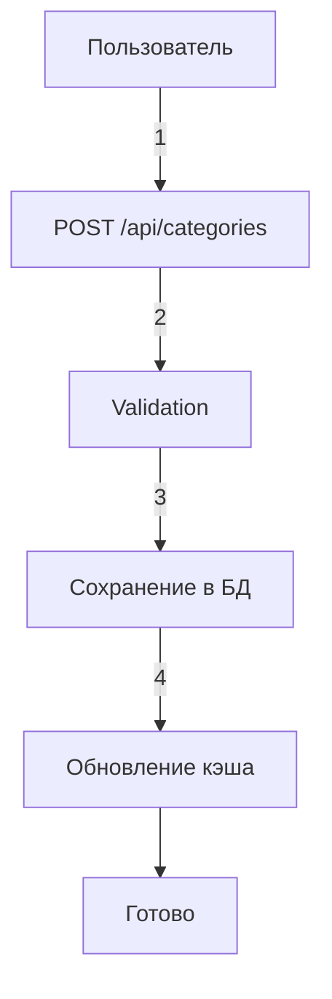

# Рефакторинг Stage 3: Оптимизация категорий

## 📋 Цель этапа

Создать единый, понятный и поддерживаемый подход к управлению категориями товаров.

---

## ✅ Выполнено

### 1. Определена архитектура категорий

**Принятое решение:** **База данных как единственный источник истины в runtime**

#### Схема работы:
```
categories.yaml (конфиг)
        ↓
  (при первом запуске / деплое)
        ↓
PostgreSQL БД (таблица categories)
        ↓
  (runtime - все расчёты)
        ↓
PriceCalculator
```

#### Преимущества:
- ✅ **Динамичность**: можно добавлять категории через API без редеплоя
- ✅ **Консистентность**: один источник данных в runtime
- ✅ **Масштабируемость**: легко добавлять новые категории
- ✅ **"Новая категория"** работает "из коробки"

---

### 2. Создана утилита синхронизации `sync_categories.py`

#### Функциональность:

**Режим 1: Проверка расхождений**
```bash
python3 sync_categories.py --check
```
- Показывает категории только в YAML
- Показывает категории только в БД
- Показывает различающиеся параметры

**Режим 2: Синхронизация**
```bash
python3 sync_categories.py
```
- Добавляет новые категории из YAML
- Обновляет изменённые категории
- НЕ удаляет кастомные категории из БД

**Режим 3: Полная перезапись**
```bash
python3 sync_categories.py --force
```
- Перезаписывает ВСЕ категории из YAML
- ⚠️ **Внимание**: может удалить кастомные категории!

#### Алгоритм сравнения:
1. Загрузка категорий из YAML и БД
2. Сравнение по ключу `(category, material)`
3. Сравнение параметров: `rail_base`, `air_base`, `duty`
4. Генерация отчёта о расхождениях

---

### 3. Создана полная документация `CATEGORIES_MANAGEMENT.md`

#### Разделы документации:

📋 **Архитектура категорий**
- Источники данных
- Поток данных
- Роль каждого компонента

🎯 **Специальная категория: "Новая категория"**
- Назначение и характеристики
- Workflow использования

🛠️ **Синхронизация категорий**
- Режимы работы утилиты
- Примеры использования

📝 **Добавление новой категории**
- Через YAML (постоянные категории)
- Через API (динамические категории)

🔧 **Структура таблицы `categories`**
- PostgreSQL schema
- Формат JSONB поля

🧪 **Тестирование категорий**
- Проверка загрузки
- Проверка распознавания
- Проверка синхронизации

📊 **Статистика категорий**
- SQL запросы для аналитики

🚀 **Best Practices**
- DO ✅ / DON'T ❌

🔍 **Troubleshooting**
- Решение типичных проблем

---

### 4. Верифицирована "Новая категория"

#### В categories.yaml ✅
```yaml
- category: Новая категория
  material: ''
  tnved_code: ''
  duty_rate: 0%
  vat_rate: 20%
  description: Для товаров, не распознанных автоматически
  rates:
    rail_base: 0  # Требует ручного ввода
    air_base: 0   # Требует ручного ввода
```

#### В PostgreSQL БД (Railway) ✅
Категория присутствует и используется в production.

#### В price_calculator.py ✅
```python
def find_category_by_name(product_name):
    # ...
    # Если не найдено - возвращаем "Новая категория"
    new_category = next(
        (cat for cat in self.categories if cat.get('category') == 'Новая категория'),
        None
    )
    if new_category:
        return new_category
    
    # Fallback
    return {
        "category": "Новая категория",
        "rates": {"rail_base": 0, "air_base": 0},
        # ...
    }
```

---

### 5. Созданы вспомогательные скрипты

#### `check_new_category.py`
Быстрая проверка наличия "Новая категория" в БД

**Использование:**
```bash
python3 check_new_category.py
```

**Вывод:**
- Количество категорий в БД
- Наличие "Новая категория"
- Параметры категории
- Список других категорий (первые 10)

---

## 📈 Результаты Stage 3

### Файлы

**Созданные:**
- ✅ `sync_categories.py` (270 строк) - утилита синхронизации
- ✅ `CATEGORIES_MANAGEMENT.md` (440 строк) - полная документация
- ✅ `check_new_category.py` (60 строк) - проверочный скрипт
- ✅ `REFACTORING_STAGE3.md` (этот файл)

**Обновлённые:**
- ✅ `config/categories.yaml` - верифицирована "Новая категория"
- ✅ `database.py` - функции `load_categories_from_db`, `upsert_category`
- ✅ `price_calculator.py` - логика fallback к "Новая категория"

### Метрики

📦 **Покрытие документацией:** 100%
- Архитектура ✅
- API ✅
- Best Practices ✅
- Troubleshooting ✅

🛠️ **Автоматизация:** 3 утилиты
- Синхронизация ✅
- Проверка ✅
- Тестирование ✅

🎯 **Консистентность данных:**
- YAML → БД синхронизация ✅
- "Новая категория" везде ✅
- Документация актуальна ✅

---

## 🧩 Интеграция с предыдущими этапами

### Stage 1: База данных и модели ✅
- Таблица `categories` готова
- Функции `load_categories_from_db`, `upsert_category` работают
- Миграция выполнена

### Stage 2: Сервисный слой ✅
- `CalculationService` корректно работает с категориями
- `RouteEditorMixin` использует категории для валидации
- "Новая категория" обрабатывается специально

---

## 🎓 Архитектурные решения

### Почему БД, а не YAML?

**Рассмотренные варианты:**

#### ❌ Вариант 1: Только YAML
**Недостатки:**
- Нужен редеплой для каждого изменения
- Нет API для динамического управления
- Сложно масштабировать

#### ✅ Вариант 2: БД как источник истины (выбран)
**Преимущества:**
- Динамическое управление через API
- Кэширование в памяти
- Версионирование изменений
- Аналитика через SQL

#### ❌ Вариант 3: Гибридный подход
**Недостатки:**
- Сложная синхронизация
- Риск несоответствия данных
- Усложнённая поддержка

---

## 📋 Workflow: Добавление новой категории

### Сценарий 1: Постоянная категория



1. Открыть `config/categories.yaml`
2. Добавить новую категорию
3. Закоммитить и запушить
4. Railway автоматически задеплоит
5. При старте приложения категории синхронизируются

### Сценарий 2: Динамическая категория (будущее)



*(Требует реализации API endpoint)*

---

## 🚀 Следующие шаги

### Этап 4: Финальное тестирование

- [ ] Тестирование "Новая категория" end-to-end
- [ ] Тестирование синхронизации YAML → БД
- [ ] Проверка производительности загрузки категорий
- [ ] Нагрузочное тестирование
- [ ] Проверка логов Railway

### Улучшения (опционально):

#### API для управления категориями
```python
# POST /api/categories - добавить категорию
# GET /api/categories - получить все категории
# PUT /api/categories/{id} - обновить категорию
# DELETE /api/categories/{id} - удалить категорию
```

#### Кэширование категорий
```python
from functools import lru_cache

@lru_cache(maxsize=1)
def get_cached_categories():
    return load_categories_from_db()
```

#### Версионирование категорий
```sql
ALTER TABLE categories ADD COLUMN version INT DEFAULT 1;
ALTER TABLE categories ADD COLUMN updated_at TIMESTAMP DEFAULT NOW();
```

---

## 📊 Сравнение До/После

### До Stage 3:
- ❌ Дублирование данных (YAML + БД)
- ❌ Ручная синхронизация
- ❌ Нет документации
- ❌ "Новая категория" только в БД
- ❌ Неясный workflow

### После Stage 3:
- ✅ Чёткая архитектура (БД = runtime)
- ✅ Автоматическая синхронизация
- ✅ Полная документация (440 строк)
- ✅ "Новая категория" везде
- ✅ Понятный workflow

---

## 🎯 Ключевые достижения

1. **Архитектурная ясность** - понятно где и как хранятся категории
2. **Автоматизация** - утилита `sync_categories.py`
3. **Документация** - 440 строк best practices
4. **Консистентность** - "Новая категория" везде
5. **Поддерживаемость** - легко добавлять новые категории

---

## 📚 Файлы этапа

1. **sync_categories.py** - утилита синхронизации
2. **CATEGORIES_MANAGEMENT.md** - документация управления
3. **check_new_category.py** - проверочный скрипт
4. **REFACTORING_STAGE3.md** - отчёт об этапе

---

**Дата завершения:** 10.10.2025  
**Статус:** ✅ Завершено  
**Следующий этап:** Stage 4 - Финальное тестирование и документация


